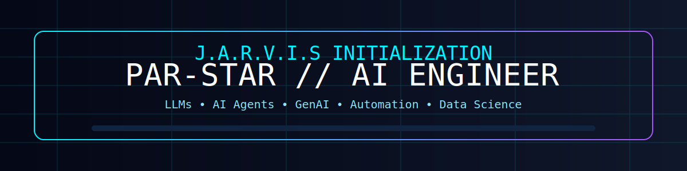
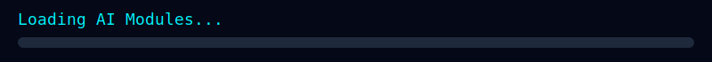
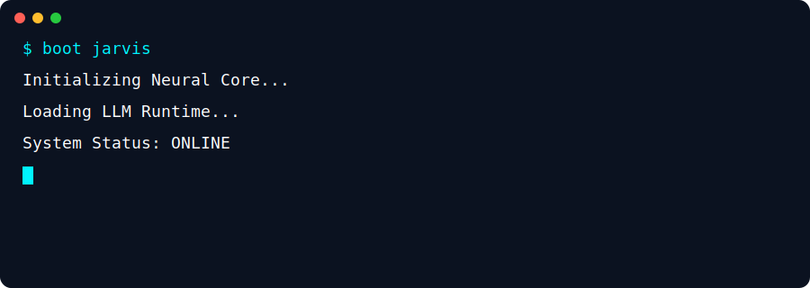

<div align="center">

# ⚡ PAR-STAR // AI ENGINEER



<p>
Building AI Agents • LLM Apps • GenAI • Automation • Data Science
</p>

<p>
<a href="https://github.com/Par-star"></a>
<a href="https://www.linkedin.com"></a>

</p>

</div>

---

# INITIALIZING J.A.R.V.I.S.

```text
> Boot sequence......................OK
> Loading Neural Core................OK
> Loading AI Modules.................OK
> Initializing LLM Runtime...........OK
> Connecting GitHub API..............OK
> Synchronizing Projects.............OK
> Status.............................ONLINE
```



---

# ABOUT ME

```yaml
name: Parika Chaudhary
github: Par-star
role: AI Engineer
education: B.Tech CSE (AI & Data Science)
focus:
  - Generative AI
  - LLM Applications
  - AI Agents
  - NLP
  - Automation
  - Computer Vision
currently_building:
  - Agentic AI Systems
  - Streamlit Apps
  - RAG Pipelines
```

---

# TECH STACK

<p align="center">


</p>

---

# GITHUB ANALYTICS

<p align="center">


</p>

<p align="center">


</p>

---

# TROPHIES

<p align="center">


</p>

---

# CONTRIBUTION SNAKE

<p align="center">

</p>

---

# FEATURED PROJECTS

| Project | Description |
|---------|-------------|
| AI Multiverse | Multi-model AI assistant with modern UI |
| AI Career Assistant | Intelligent recommendation platform |
| Smart QC | AI-powered quality inspection |
| RAG Chatbot | Retrieval-Augmented Generation system |

---

# TERMINAL



---

# CONNECT

<p align="center">

<a href="https://github.com/Par-star">GitHub</a> •
<a href="https://www.linkedin.com">LinkedIn</a> •
<a href="mailto:your-email@example.com">Email</a>

</p>

---

<div align="center">

### "Building the future with Artificial Intelligence."

⭐ Thanks for visiting!

</div>
